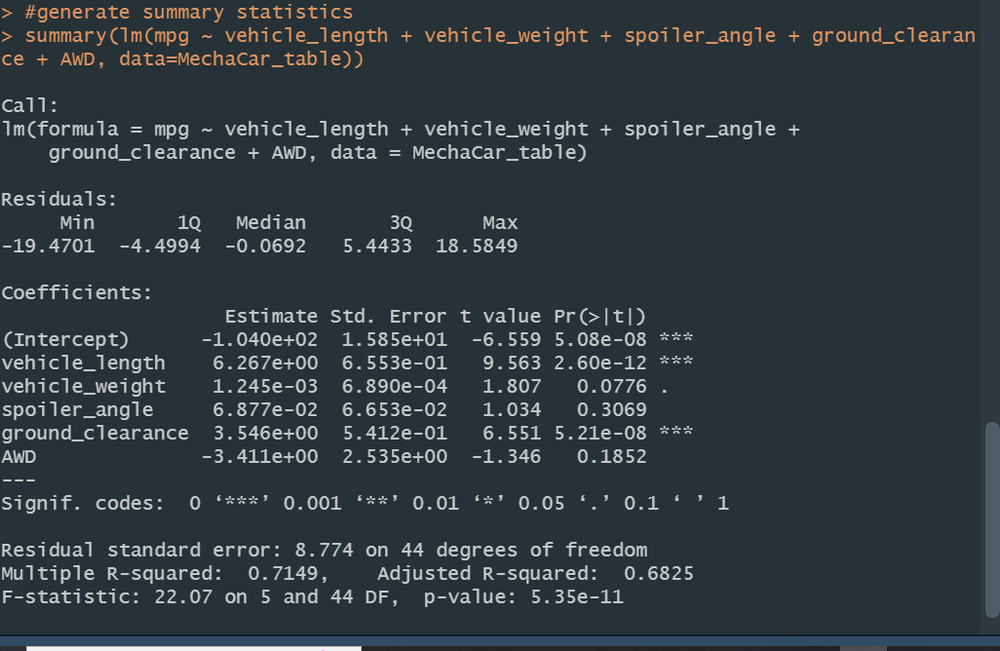
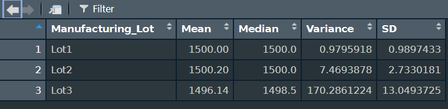
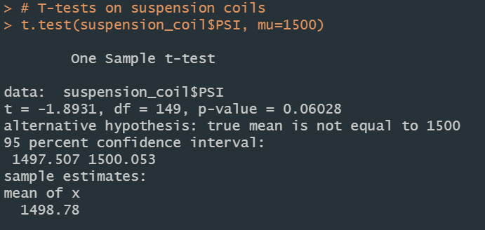
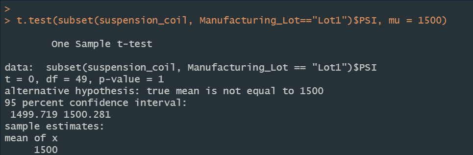
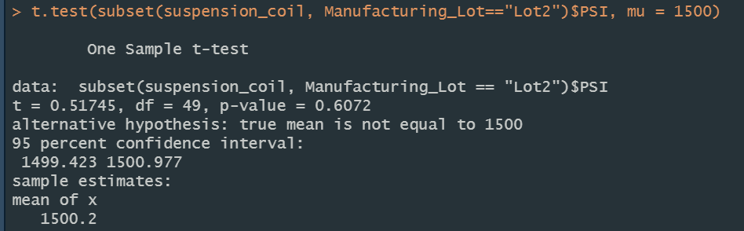
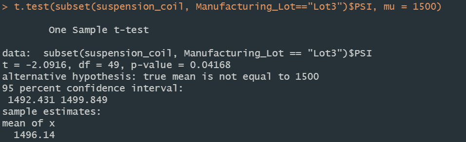

# MechaCar_Statistical_Analysis
# MechaCar Statistical Analysis
Statisitical analysis of automobile performance with R

## Overview
AutosRUs' new MechaCar is "suffering from production troubles" and the company is hoping that an analytical review may help provide some insight. The goal of this project is to:
* discover which variables predict the MPG for vehicle prototypes;
* collect summary stats on the PSI of suspension coils;
* determine if manufacturing lots are statistically different from the mean population;
* design a study to compare the MechaCar performance against vehicles from other manufacturers.

## Results

### Multiple Linear Regression to Predict Miles per Gallon

* Coefficients providing non-random amount of variance to the mpg values: The variables **Vehicle Length** and the **Ground Clearance** provide a non-random amount of variance on the MPG values in the dataset. Their p-values are:

  * **Vehicle Length**: 2.6x10-12
  * **Ground Clearance**: 5.21x10-8

  The intercept was also statistically significant, indicating that there are likely other factors, not included in our dataset, that have a strong impact on the MPG values.
* Slope of the linear model: The slope of the linear model can not be considered to be zero as the p-value, 5.35x10-11, is lower than an extreme level of significance. Thus the null hypothesis must be rejected. This means that the relationship between our variables and the miles per gallon is subject to more than random chance.
* Effectiveness of the linear model: Although there are still unconsidered factors, this model does predict the mpg values of MechaCar prototype with some relative effectiveness. The r-squared value of 0.7149 indicates that the model is 71% accurate.

### Summary Statistics on Suspension Coils

* The overall variance is under 100 PSI and meets the expected specifications. However, the variance for Lot 3 is well over the acceptable threshold, at 170.28.

### T-Tests on Suspension Coils

* The overall T-test shows that the PSI attribute is not statistically different from the population mean, and the p-value is *not* low enough (0.0603) for us to reject the null hypothesis.

* The `Lot1` specific T-test shows the PSI attribute is not statistically different from the population mean, and the p-value is *not* low enough (1) for us to reject the null hypothesis.

* The `Lot2` specific T-test shows the PSI attribute is not statistically different from the population mean, and the p-value is *not* low enough (0.6072) for us to reject the null hypothesis.

* The `Lot3` specific T-test shows the PSI attribute is slightly statistically different from the population mean, and the p-value is *just low enough* (0.0417) for us to reject the null hypothesis.

## Study Design: MechaCar vs Competition
Consumers consider multiple factors when evaluating a car to purchase. While we consider mpg as a factor, we can also compare a complimentary factor of how powerful the car is in terms of horsepower.
### Metric to test
To narrow down our test, we should evaluate MechaCar's horse power, in comparison to various competitors' vehicles.
### Null and Alternate Hypothesis
H0: MechaCar prototypes' average horse power is similar to competitor's vehicles in the same vehicle class
Ha: MechaCar prototypes' average horse power is statistically above or below that of competitor vehicles.
### Statistical Test Used
The best statistical test for this would be two-sample t-tests.
### What data is needed
We would need to gather data related to pick-up and carrying power from all MechaCar prototypes, as well as from all major competitor vehicles.
